# System Topology and Dataflow Diagrams

This document illustrates the data flows and runtime relationships of components inside the AI Network Traffic Analyzer platform.

---

## 🔄 Live Ingestion Dataflow

This diagram outlines how a captured network packet traverses the background queue thread to reach the database, alert engine, and frontend UI in real-time.

```mermaid
sequenceDiagram
    autonumber
    actor Network as Network Interface
    participant Sniffer as Scapy Sniffer Thread
    participant Queue as thread-safe Queue
    participant Worker as Parser Consumer Worker
    participant Analyzer as Traffic Analyzer Registry
    participant Database as PostgreSQL DB (Neon)
    participant UI as Operator React Dashboard

    Network->>Sniffer: Raw Network Frame (Layer 2/3/4)
    Sniffer->>Queue: Enqueue Raw Frame (put_nowait)
    Note over Sniffer,Queue: Prevents kernel drops
    
    Worker->>Queue: Fetch Raw Frame (blocking get)
    Worker->>Worker: Parse Packet Layers (Ethernet/IP/TCP)
    Worker->>Analyzer: Register Packet stats & payload
    
    rect rgb(20, 24, 33)
        Note over Analyzer,Database: DB Batching (50 packets or 2s)
        Analyzer->>Database: insert_packets_bulk()
    end
    
    rect rgb(34, 18, 20)
        Note over Analyzer,Database: Window Evaluation (every 5 seconds)
        Analyzer->>Database: insert_ai_trend() & insert_alert()
    end
    
    UI->>Analyzer: Poll `/recent-packets` / `/metrics` (REST)
    Analyzer-->>UI: JSON Array response (updated states)
```



---

## 🌐 Application Architecture Topology

This topology represents the container boundaries, proxy bindings, database pools, and external integration points of the platform.

```mermaid
graph TD
    subgraph Client Space
        Browser["React Client (Vite)"]
        SIEM["SIEM/SOAR Clients"]
    end

    subgraph Container Node (Nginx Proxy)
        Nginx["Nginx Reverse Proxy"]
    end

    subgraph Service Node (Backend API)
        Flask["Flask Web API"]
        SniffThread["Scapy Sniffer Worker Thread"]
        IForest["Isolation Forest Anomaly Classifier"]
    end

    subgraph Persistence Layer
        Postgres["Neon PostgreSQL Database"]
    end

    %% Client Links
    Browser -->|HTTP requests /api/*| Nginx
    SIEM -->|Token API calls| Nginx

    %% Proxy Routing
    Nginx -->|Proxy Pass http://backend:5000/| Flask

    %% Service Operations
    Flask -->|Controls sniffer state| SniffThread
    SniffThread -->|Queries features| IForest
    Flask -->|Queries stats| Postgres
    SniffThread -->|Persists packets & alerts| Postgres
```
